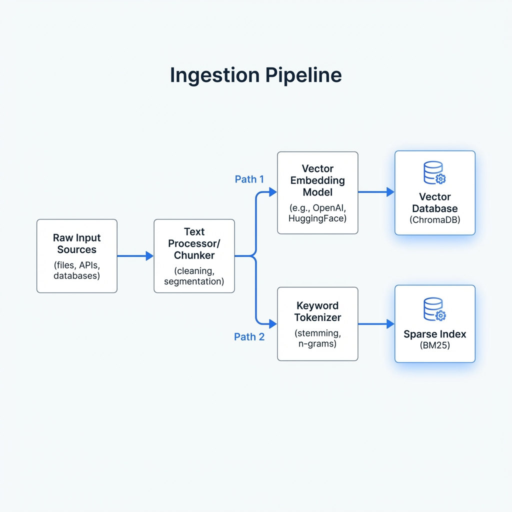

# HybridRAG: Intelligent Search System

This project implements a **Hybrid Retrieval-Augmented Generation (RAG)** system that combines **Dense Retrieval** (Vector Embeddings) and **Sparse Retrieval** (BM25) using **Reciprocal Rank Fusion (RRF)** to provide accurate and context-aware answers from a knowledge base. It includes a comprehensive automated evaluation pipeline.

## 🚀 How to Run

### Prerequisite
Ensure you have Python installed and the dependencies from `requirements.txt` (if available) or install manually:
```bash
pip install streamlit transformers torch sentence-transformers pinecone-client pinecone rank_bm25 matplotlib tqdm xhtml2pdf
```

### Configuration
This project uses **Pinecone** for vector storage. 
We have provided the api key in the config.py file so that you can use it directly.


### 1. Start the Search UI
To launch the interactive Streamlit application:
```bash
streamlit run app.py
```
*   **Ingestion**: You can trigger the data ingestion process directly from the UI sidebar.
*   **Search**: Enter your query to get an answer with citations and confidence scores.

### 2. Run Automated Evaluation
To execute the full evaluation suite (metrics, ablation, plots, report):
```bash
python run_evaluation_pipeline.py
```
This single command will:
1.  Calculate performance metrics (Semantic, BLEU, MRR, LLM Judge).
2.  Run ablation studies (Dense vs. Sparse vs. Hybrid).
3.  Generate visualization plots.
4.  Produce a final PDF report in `files/evaluation_report.pdf`.

---

## 🏗️ Architecture Design

The system follows a modular architecture designed for high precision and robustness.

### Core Components
1.  **Ingestion Pipeline**: Processes raw data into retrievable chunks.
2.  **Response Pipeline**: Handles retrieval (Hybrid + RRF) and generation (LLM).
3.  **Evaluation Pipeline**: Automated testing and reporting suite.

### Architecture Diagram


---

## 🛠️ Pipeline Details

### 1. Ingestion Pipeline
*   **Script**: `ingestionPipeline/ingest_pipeline.py`
*   **Function**:
    *   Fetches content from URLs.
    *   Splits text into manageable chunks.
    *   **Vectorization**: Generates embeddings using `sentence-transformers/all-mpnet-base-v2` and stores them in **Pinecone**.
    *   **Indexing**: Builds a BM25 index for keyword search and saves it as a pickle file.
*   **Data output**: `files/bm25_model.pkl`, `files/metadata.json`. Pinecone index is hosted in the cloud.


### 2. Response Pipeline
*   **Scripts**: `reponsePipeline/llm_rag_response.py`, `reponsePipeline/rrf.py`
*   **Function**:
    *   **Hybrid Retrieval**: Retrieves documents using both Dense (semantic) and Sparse (keyword) methods.
    *   **RRF**: Fuses results to rank the most relevant documents higher.
    *   **Generation**: Uses `google/flan-t5-large` to generate an answer based *strictly* on the retrieved context.
    *   **Monitoring**: Tracks Latency and Confidence scores.

### 3. Evaluation Pipeline
*   **Scripts**: `evaluationPipeline/`
*   **Methods**:
    *   **MRR**: Mean Reciprocal Rank (URL level) to check retrieval accuracy.
    *   **Semantic Similarity**: BERTScore/Cosine Similarity against ground truth.
    *   **BLEU**: Lexical overlap metric.
    *   **LLM-as-a-Judge**: Uses an LLM to rate answer quality (1-5).
    *   **Faithfulness (NLI)**: Uses an NLI Cross-Encoder model to check if the answer is logically entailed by the context (Hallucination Detection).
    *   **Ablation Study**: Compares Hybrid vs. Single-method retrieval.
    *   **Calibration**: Measures how well confidence correlates with accuracy.
*   **Output**: `files/questionanswers.json`, `files/evaluation_report.pdf`, `files/plots/`.

**Process Flow:**
1. **Load QA Dataset**: Reads `files/questionanswers.json`.
2. **Calculate Metrics**: Computes Semantic Similarity, BLEU, and LLM Judge scores.
3. **Run Ablation**: Performs retrieval using Dense-only and Sparse-only methods for comparison.
4. **Generate Plots**: Creates visualizations in `files/plots/`.
5. **Generate Report**: Compiles everything into `files/evaluation_report.pdf`.

## 📂 Data Directory Structure (`files/`)
All persistent data is stored in the `files/` directory:

*   `metadata.json`: Master index of all text chunks.
*   `questionanswers.json`: Generated Q&A dataset with evaluation results.
*   `evaluation_report.pdf`: Final generated report.
*   `plots/`: Visualization images (PNG).
*   `bm25_model.pkl`: Sparse index file.

